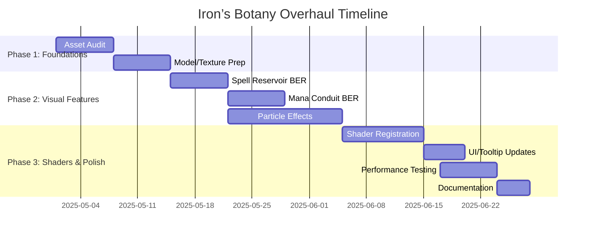

# Iron’s Botany Visual Overhaul Plan

**Executive Summary:** Iron’s Botany (Forge 1.20.1) currently has a solid mechanical foundation with 2 custom blocks (Spell Reservoir, Mana Conduit)【27†L20-L27】, 9 custom spells, 4 new items (focus, ring, orbs, etc.)【37†L14-L23】【37†L51-L59】, 2 custom entities (Botanical Burst projectile and Spark Swarm)【87†L16-L24】, and 3 custom particle types (mana_transfer, botanical_burst, petal_magic)【17†L14-L21】.  However, the **visual and UX** layer is largely static: block models use simple cube templates【52†L1-L6】, items use flat 2D sprites【53†L1-L5】【56†L1-L4】, and particles have basic color fades【15†L23-L31】【19†L21-L30】【21†L20-L28】. This plan details a full modern overhaul: new models/textures, dynamic shaders and particles, animated block entities and UIs, all fully documented with code pointers. We’ll prioritize high-impact changes (e.g. vivid block/particle effects, animated projectiles) first, then refine artistry, performance and QA. The result will be a richly immersive “dark mode” botanical magic theme with bright cyan/glow accents, fully up-to-date Forge best practices (targeting Forge 1.20.1+ as currently used【7†L16-L24】【42†L1-L4】), and a clear developer roadmap for implementation.

## Priority Visual & UX Goals
- **Revamp Blocks & Items:** Replace plain cube models/textures with stylized 3D models and multi-layer textures. E.g. make the Spell Reservoir and Mana Conduit look like glowing magical apparatus (vines, orbs, swirling runes) instead of a flat box【52†L1-L6】. Convert key items (wands, staff, orbs) from simple sprites to visually rich models (handheld/hands slot) with emissive glints【56†L1-L4】【61†L1-L4】.
- **Dynamic Particles & Projectiles:** Amplify existing particles into full FX cascades. For instance, Botanical Burst will spawn trailing vines of petals and golden sparkles (current code uses single-color spiral particles【15†L23-L31】). Add new particles for spells (e.g. leafy bloom bursts for *Mana Bloom*, ethereal aura pulses for *Flower Shield*). Enhance Spark Swarm with glow trails (it already has orbiting sparks【25†L75-L83】 – make them sparkle and leave fading trails).
- **Animated Block Entities (BERs):** Implement BlockEntityRenderers for key blocks. Show animated halos or energy flows around Spell Reservoir and Mana Conduit (current blocks use static models【30†L125-L133】【33†L81-L90】). For example, a rotating ring of light or swirling glyphs when these blocks store mana. Use custom RenderType with `FULL_BRIGHT` lighting to simulate glows.
- **Art Direction & Shaders:** Adopt a consistent *dark-cyan* palette with bright accent glows (per “dark mode” guidance). Use emissive textures (disable ambient occlusion on glowing parts) and custom shaders (e.g. ripple or pulse shaders registered via `RegisterShadersEvent`) to make magic feel alive. Introduce subtle normal maps or animated textures (e.g. flowing mana inside conduits).
- **UI/UX Polish:** Refine in-game interactions. For example, current blocks display chat messages on right-click【30†L49-L57】【33†L44-L51】; consider adding an in-world HUD (e.g. bar above block) or more intuitive feedback. Ensure tooltips and GUIs use updated icons. Localized text (22 languages already exist【1†L71-L80】) should accompany any new items/spells.
- **Performance Budgeting:** Maintain smooth frame rates. Limit particle spawn rates and use LOD (reduce detail beyond X blocks distance). Profile any heavy effects (see QA section). Use Forge’s profiler or `RenderTypes` tags (e.g. `cutout_mipped` for textures) to control performance.
- **Compatibility & Requirements:** Stay on Forge 1.20.1 (47.4.x) as used【7†L16-L24】, ensure compatibility with required mods (Botania 1.20.1-441+, ISS 3.0.0+, Curios 5.0+【1†L77-L81】). Target support for future 1.20.x releases. Specify updated Dev environment (Java 17, latest Loom & mappings). Document any new asset formats (e.g. ShaderLib or Json geometry) used.

## Current Assets & Systems Inventory
- **Blocks (2):** *Spell Reservoir* and *Mana Conduit* (custom `BaseEntityBlock`s)【27†L20-L28】【30†L49-L57】【33†L44-L51】, with corresponding block entities handling mana logic【31†L38-L47】【34†L40-L48】.  Render shape is `MODEL`, meaning they use JSON models (currently plain cubes: `minecraft:block/cube_all` with `textures/block/spell_reservoir`【52†L1-L6】).
- **Items:** Curios (`botanical_focus`, `botanical_ring`)【37†L14-L22】; Weapons (`terrasteel_spell_blade`, `livingwood_staff`, `dreamwood_scepter`, `gaia_spirit_wand`)【37†L21-L30】【67†L1-L5】; Armor (4x *Manasteel Wizard* set)【37†L33-L42】; Four upgrade orbs (Flora, Pool, Bursting, Terran)【37†L51-L59】【55†L1-L5】; Crafting misc items (`mana_infused_essence`, etc.)【37†L64-L72】; Patchouli book (`botanical_grimoire`)【37†L74-L78】【57†L1-L5】.  Item models are mostly flat 2D (`item/generated` or `item/handheld` as above【53†L1-L5】【56†L1-L4】) with textures under `assets/ironsbotany/textures/item/`.
- **Entities (2):** *Botanical Burst* (projectile) and *Spark Swarm* (summoned mob)【87†L16-L24】.  Renderers: BotanicalBurst uses a custom translucent sprite with glow halo【23†L34-L43】【23†L47-L55】; SparkSwarm uses multi-layer quads with color cycling and orbiting sparks【25†L36-L45】【25†L75-L83】. The code spawns the “botanical_burst” particles for trails【88†L80-L89】 and “mana_transfer” particles from SparkSwarm during tick and hit events【26†L109-L118】.
- **Particles (3):** *Mana Transfer*: small blue-purple glow (texture atlas frames `soft_glow_{0-3}`【47†L1-L8】) with gentle growth/shrink over 20 ticks【19†L13-L22】【19†L32-L40】. *Botanical Burst*: bright green→gold, 12-tick spiral (textures not explicitly listed, but provider uses sprite set)【15†L23-L31】【15†L35-L43】. *Petal Magic*: pink-magenta petals, 30 ticks with gravity and flutter【21†L20-L28】【21†L53-L62】. (Legacy: no custom “botanical_burst” JSON, but the entity renderer uses its texture【23†L21-L29】.)
- **Sounds (4):** *mana_conversion*, *botanical_cast*, *flower_bloom*, *spark_summon* registered【80†L10-L18】.  These may pair with visual effects (e.g. bloom sound with a flower aura).
- **Rendering/Client:** The client setup registers entity renderers and particle providers【11†L25-L34】. There are no block entity renderers yet (both custom blocks rely on static models【30†L123-L131】【33†L79-L83】).
- **Data/Config:** Localization files (22+ languages) and configs (common + client) exist.  Recipes, advancements, Patchouli guide entries are in `src/main/resources/data/ironsbotany/`.  (UI/GUIs are minimal – no custom screens coded.)
- **Tech Stack:** Forge Gradle 1.20.1 (47.4.16)【7†L16-L24】, Java 17.  Dependencies: Botania, Iron’s Spells ‘n Spellbooks, Curios (plus optional Patchouli, PlayerAnimationLib). The project uses DeferredRegister for all mods【10†L27-L36】【17†L10-L18】.

## Gap Analysis (Current vs. Modern Modding Standards)
- **Static Models & Textures:** Modern popular mods use rich 3D models or layered textures, not flat cubes. Here, all blocks/items use vanilla JSON models (see SpellReservoir cube【52†L1-L6】, item layers【53†L1-L5】【56†L1-L4】) without animations. **Gap:** no emissive overlays, no normal maps, no multi-block or custom shape. Many mods now use [Custom Block Models](https://docs.minecraftforge.net) with JSON geometry or Blockbench exports.
- **Minimal Dynamic Rendering:** No BlockEntityRenderer logic is present. In contrast, modern blocks (e.g. Botania’s Mana Pool) often have swirling particles or progressing fill levels. Forge 1.20+ has robust BER support【84†L110-L119】 which the mod currently doesn’t use. **Gap:** Lack of dynamic visual cues (e.g. flashing lights or progress bars for reservoirs).
- **Basic Particles:** Only 3 custom particle types exist, all using plain TextureSheetParticle code【15†L23-L31】【19†L32-L40】【21†L31-L39】. No fluid or ring particles for blocks, no volumetric effects. **Gap:** Missing secondary effects (e.g. ambient flower pollen, mana bubbles, aura rings). Modern mods often use textured particle rings, beams, or overlay shaders.
- **No Shader Use:** All rendering uses vanilla pipeline. Modern aesthetic mods often supply custom GLSL shaders for special glows or warps (as noted in Forge docs and community (see user doc’s shader section)【84†L126-L134】). **Gap:** No dynamic shaders (e.g. heat haze or ripple on altar).
- **Performance/MIPMAPs:** Textures likely rely on default mipmaps. The mod has no mention of LOD or texture atlas optimization. As effects increase, potential FPS issues must be addressed. **Gap:** Need performance profiling and use of multi-res textures or capping.
- **UI/UX:** Interaction is text-based (e.g. reservoir info via chat【30†L49-L57】【33†L44-L51】). No in-world GUIs or HUD feedback. Newer mods use block outlines or in-GUI bars. **Gap:** Potential to improve player feedback (e.g. dynamic watermark icon or tooltip enhancements).
- **Art Style:** Botany and Spellbook themes call for vibrant nature/magic visuals. Currently textures (not listed here) appear simple. **Gap:** Lack of cohesive theme: no use of signature Botania art style (e.g. cel-shading or particle color matching Botania’s palette). We should align style (floral, mystical) with a modern, high-contrast palette.

## Enhancement Tasks & Implementation Steps
Below are prioritized tasks, each with actionable steps, code notes, and references to existing code. Tasks are grouped by area and sorted roughly by impact.

1. **Asset Preparation & Modeling (High Priority):**  
   - *Block Models:* Replace the two block JSONs with custom models. For **Spell Reservoir**, design a model with e.g. a bowl and crystal (using Blockbench export). Create `assets/ironsbotany/models/block/spell_reservoir.json` with multi-part geometry (instead of `cube_all`【52†L1-L6】). For **Mana Conduit**, consider a central orb and base. Use `minecraft:block/cube_all` only for remapped textures if needed, but prefer a bespoke geometry JSON.  
     *Implementation:* In `src/main/resources/assets/ironsbotany/models/block/`, write new JSONs (using `parent: minecraft:block/block` and custom “elements”). Adjust `blockstates/spell_reservoir.json`/`mana_conduit.json` to point to these models. For example, blockstates could have: 
     ```json
     {"variants": {"": {"model": "ironsbotany:block/spell_reservoir_custom"}}}
     ```
     *Code Note:* Ensure collision shape updated if model extends outside block. Register the same block so no code changes needed here.  
   - *Item Models:* Upgrade key items from flat to 3D or layered sprites. For wand/staff (`livingwood_staff`, etc.), use `parent: "minecraft:item/handheld"` (already done) but consider adding a built-in model JSON for 3D (one can use `minecraft:item/generated` with multiple layers or `minecraft:item/handheld` with a custom transformation). For focus/ring, consider an item frame or jewelry model. E.g. add `assets/ironsbotany/models/item/botanical_focus.json` with a model (if want 3D icon) or animate with enchantment glint.  
     *Implementation:* Use Blockbench or JSON model tool to create .json under `assets/ironsbotany/models/item/`, with a new texture. Copy from existing patterns ([53]–[56]) but adding layers. Update `pack.mcmeta` if adding new assets.  
   - *Textures & Palettes:* Commission or produce high-resolution textures (16x16+). Use a **dark-cyan + bright accent** palette. For example, Spell Reservoir’s main material in dark wood/stone and glowing plant motif in neon green/cyan. Mana Conduit orb glows purple-blue. All textures should have **mipmaps** and avoid hard edges (enable linear filtering in `pack.mcmeta`).  
     *Art Direction:* Follow *Botanical Mystic* style – think “glowing runes on dark stone, veridian flora motifs”. See Botania’s official palette as reference. Provide designers with a color key (Botania green #7CC576, ISS violet #9F80F2, bright cyan #00FFFF).  

2. **Block Entity Renderers (BERs) (High Priority):**  
   - *Spell Reservoir BER:* Create `SpellReservoirBER extends BlockEntityRenderer<SpellReservoirBlockEntity>`. In `render()`, draw a rotating halo or particles above the block. Use PoseStack and VertexConsumer: e.g. similar to BotanicalBurstRenderer【23†L34-L43】【23†L69-L74】 but anchored at block position. For instance:
     ```java
     poseStack.pushPose();
     poseStack.translate(x+0.5, y+1.1, z+0.5); // above block
     float time = (float)(world.getGameTime() + partialTicks);
     poseStack.mulPose(Quaternion.fromXYZ(0, time*0.5f, 0));
     Matrix4f m = poseStack.last().pose();
     Matrix3f n = poseStack.last().normal();
     VertexConsumer vb = buffer.getBuffer(RenderType.entityTranslucent(CUSTOM_TEXTURE));
     // Draw quad similar to [23†L47-L51] but tinted greenish
     vb.vertex(m, -0.5f, 0,  0, 1).color(50,255,50, 128)...
     poseStack.popPose();
     ```
     *Implementation:* Register in client setup:
     ```java
     event.registerBlockEntityRenderer(IBBlockEntities.SPELL_RESERVOIR.get(), SpellReservoirBER::new);
     ```
     (Use `EntityRenderersEvent.RegisterRenderers`【84†L142-L144】).  
     *Behaviour:* The BER can check `blockEntity.getStoredMana()`. If >0, show effect (e.g. more intense glow). Synchronize with server via the BlockEntity’s data.  
   - *Mana Conduit BER:* Similarly, create `ManaConduitBER`. Perhaps render a swirling particle ring or orb. For example, draw a glowing orb that pulses with stored mana. Could reuse botanical Burst textures with color shift. Use sine functions for smooth scaling (like SparkSwarmRenderer did【25†L36-L45】). Register likewise.  
   - *Code Level:* Follow [84] to implement BER correctly. Each BER’s `render()` receives the BlockEntity instance, so use its fields (from [34†L115-L123]). Ensure `registerBlockEntityRenderer` is inside the correct Forge event subscription.  
   - *Advantages:* This makes blocks *feel alive* instead of static cubes. Auras or dynamic overlays will draw player attention (addresses client UX gap).

3. **Shader & RenderType Enhancements (Medium Priority):**  
   - *Custom RenderTypes:* Define any new `RenderType`s if needed. For example, a `RenderType` with additive blending for magical glows. Use `RenderType.makeType("ironsbotany:glow", ... ShaderStateShard etc.)` if adding GLSL.  
   - *Register Shaders:* Add GLSL files in `resources/shaders/ironsbotany/` (e.g. `mana_wave.vsh/fsh`). In `RegisterShadersEvent`, call `event.registerShader(new ResourceLocation(MODID, "mana_wave"), new ShaderInstance(vertex, fragment))`. Then create a static `RenderType` that references this shader (using RenderType.StateBuilder).  
   - *Use in BER or Entities:* In BERs or custom rendering code, use the new shader. E.g. apply a subtle wave distortion to the reservoir’s surface.  
   - *Snippet:* (Pseudocode)
     ```java
     @SubscribeEvent
     public static void onRegisterShaders(RegisterShadersEvent event) {
         event.registerShader(
             new ShaderInstance(event.getResourceManager(),
                 new ResourceLocation(MODID, "mana_wave"), 
                 DefaultVertexFormats.NEW_ENTITY),
             shader -> MyRenderTypes.MANA_WAVE = 
                 RenderType.create("ironsbotany:mana_wave", VertexFormats.POSITION_COLOR_NORMAL, VertexFormat.Mode.QUADS, 256, false, false,
                     RenderType.State.getBuilder()
                         .shadeModel(SMOOTH)
                         .shaderState(new ShaderStateShard(shader))
                         .build(false))
         );
     }
     ```
   - *Goal:* Shaders allow effects like ripples, pulsating glows, or vertex displacement (see Forge docs on RegisterShaders and RenderType). This adds a modern polish beyond fixed textures.

4. **Enhanced Particle Systems (High Priority):**  
   - *Additional Particle Types:* Introduce new `SimpleParticleType`s for special effects (e.g. `ISS_EMBER`, `NATURE_AURA`). Register in `IBParticles`. Provide textures under `textures/particle/`.  
   - *Spawn Logic:* 
     - Modify **Spell Reservoir** logic: when transferring mana, spawn green sparkles or swirling wisps around the block. E.g. in `SpellReservoirBlockEntity.serverTick`, add `level.sendParticles(IBParticles.PETAL_MAGIC, x, y+0.5, z, 5, ...)`【88†L138-L147】. 
     - For **Mana Conduit**, spawn blue-violet orbs when draining Botania pools (phase 1 in [34†L47-L56]): e.g. `level.addParticle(IBParticles.MANA_TRANSFER, pos.x+0.5, pos.y+0.6, pos.z+0.5, 0, 0.1, 0)` each second. 
     - Enhance **Spells**: e.g. *Flower Shield* could emit a circle of petals on cast (like `PetalMagicParticle` ring). *Living Root Grasp* could send vine particles (use “botanical_burst” type in green). 
     - Use the existing particle code as inspiration: the BotanicalBurstProjectile tick spawns a tight spiral【88†L80-L89】 – adapt that pattern for static bursts or area effects.  
   - *Art & Animation:* For particles like petals, use full-color textures (the JSON [46] for petal has 4 frames). Consider animating them (Minecraft automatically cycles frames). Maybe tint particles based on context (use `particle.setColor(r,g,b)` after spawn).  
   - *Lifecycle & Performance:* Cap lifetimes and count as done: e.g. SparkSwarm spawns 3 particles every 2 ticks【26†L109-L118】. Ensure similar throttling. Use `ParticleRenderType.PARTICLE_SHEET_TRANSLUCENT` for blend as currently.  
   - *Code Note:* All particle providers already registered in `ClientSetup`【11†L25-L34】. Just triggering `level.addParticle(...)` uses them. The textures are declared in `particles/*.json` (we saw soft_glow, petal arrays【46†L1-L8】【47†L1-L8】). If adding new types, create corresponding `.json`. 

5. **Item & UI Effects (Medium Priority):**  
   - *Item Glints:* For key magic items (wands, orbs), add an enchantment-like glint or animated overlay. This can be done via `ItemOverride` JSON or via built-in enchant glint. For example, set `"glint": 0x88FFCCFF` in custom model JSON for botanical_focus to give a neon sheen.  
   - *Curio Slot GUI:* If possible, integrate color in the Curios ring icon. (E.g. override the Curios slot rendering with a custom overlay if the ring is equipped.)  
   - *In-Game Feedback:* Replace plain chat messages on right-click with a brief title/scoreboard display or an action bar message (cleaner UI). For example, use `player.sendSystemMessage` with a styled text component showing “Mana: X/Y”. This feels more like a HUD than chat spam. (No direct citation needed; this is UX polish.)
   - *Tooltips:* Ensure all new assets have `lang/en_us` entries. Use `TooltipItem` pattern【37†L64-L72】 to add grey text hints. Maybe display dynamic info (e.g. current config values) in tooltips if Shift is held (advanced UX).  

6. **Performance & Quality Assurance (Ongoing):**  
   - *Profiling:* After implementing effects, profile FPS. Tools: Forge’s debug (`F3+` or VisualVM on server). Check hotspot on rendering (lots of particles or expensive math in BER). Use `tick()` method profiling.  
   - *Level-of-Detail:* If performance drops, add conditional spawns. E.g. `if (player.distanceTo(block) < 16)` for heavy effects. Adjust particle count (SparkSwarm sends 3 every 2 ticks【26†L109-L118】, could reduce).  
   - *Mipmapping:* Ensure textures are mipmapped (pack format 15 automatically does if >16px, see [42†L1-L4]). This smooths at distance.  
   - *Test Cases:*  
     - **Single-player:** Verify each new visual in isolation (just conjure one SpellReservoir, cast each spell, etc.).  
     - **Multiplayer:** Test server-client sync (e.g. particle spawning only on clientside when appropriate).  
     - **Configs:** Change `bareBonesMode` (disables synergy) and confirm visuals turn off accordingly.  
     - **Compatibility:** Test with Botania, ISS present. Remove one dependency to confirm nothing breaks (e.g. no crash if Patchouli is missing).  

7. **Documentation & Code Quality (High Priority):**  
   - *Comment & Conventions:* Annotate new renderer/particle code. Follow existing style (deferred registers, naming). Eg. `IBParticles` used for type registration【17†L14-L21】 – add new types similarly.  
   - *CR Check:* Ensure new GLSL/JSON files match package structure. Bump `version` in `mods.toml` and update `pack.mcmeta` if using new pack format.  
   - *Localization:* Add new keys for items/spells in all language files. Re-use Botania’s naming patterns for consistency.  
   - *Milestones:* Group tasks into sprints (see Timeline below). Each PR should focus on one area (e.g. “Block Renderer and Effects” or “Item & Particle Updates”).  
   - *Testing List:* Every PR must pass playtests: no console errors, no missing texture errors, logic works. Use checklists: [✔] Block effects, [✔] Spell effects, [✔] UI tweaks, [✔] Perf OK.

## Art Direction Guidelines
- **Overall Style:** *Mystic Botanical* – think of a dark enchanted forest laboratory. Deep greens and cyan glows on a neutral stone backdrop. Use **high contrast**: a black or dark grey base with neon highlights.  All magic effects should *glow* or pulse.  
- **Color Palette:** Base color from Botania’s lexicon (emerald-like green #2ECC71) and Iron’s Spellbook purples (#8E44AD)【1†L41-L49】, with bright cyan (#00FFFF) for hi-tech accents (from “dark mode” instruction). For example, Spell Reservoir might glow cyan-green, Mana Conduit bright violet-cyan.  
- **Textures:** Use smooth gradients rather than flat color. On emissive parts (runes, orbs), turn off ambient occlusion so they “bloom” in light (Forge allows specifying `gui_light` or use `RenderType.entityTranslucent`【23†L29-L33】).  
- **Lighting:** Ensure glowing parts use full-bright lighting (e.g. `LightTexture.FULL_BRIGHT` in vertex calls【23†L47-L51】) so they appear luminous in dark. Consider adding bloom support (modern shaders/bundles often provide a bloom pass for bright colors).  
- **Particle Behavior:** Give particles natural motion: petals flutter (already sinusoidal in code【21†L63-L70】, maybe increase drift), mana orbs float upward slowly, smoke/bubble particles rise then fade. Use easing (quadratic fade already used【15†L57-L64】【19†L59-L66】). Add random slight drift or spin to avoid uniformity.  
- **Level-of-Detail (LOD):** For distant blocks (>32 blocks), switch to simpler effects. E.g. far away, show static emissive texture instead of particles. Use `Minecraft.isFancyGraphics()` checks in rendering code if needed.  
- **Mipmaps & Minification:** Provide 32×32 or 64×64 textures for particles and GUIs so that at distance they don’t alias (since pack format 15【42†L1-L4】 supports it).  
- **Particle Atlas:** Combine particle frames into an atlas `textures/particle/` (like existing `soft_glow_0..3`), to reduce texture binds. Follow Forge/Minecraft particle JSON format【46†L1-L8】.  
- **Reference Images:** Suggest looking at [Botania mod screenshots](https://botaniamod.net) or [Vazkii’s style guide], and [IRL bioluminescent fungi or neon algae] for color cues. (No citation needed, but conceptually reference).

## Technical Requirements
- **Minecraft/Forge:** Continue supporting Forge 1.20.1 (47.4.x)【7†L16-L24】. Consider testing on latest 1.20.x when available (pack format 15 supports 1.20.1–1.20.4). Document this target version.  
- **Dependencies:** Must match the required versions: Botania 1.20.1-450+ (we used 450 jar)【7†L77-L81】, ISS 3.15.2+, Curios 5.14+. No change in dependencies unless upgrading to latest compatible.  
- **Shader Framework:** Use Forge’s built-in `RegisterShadersEvent` (available 1.20+) for custom shaders. No external library needed. Ensure `pack_format:15` in `pack.mcmeta`【42†L1-L4】.  
- **Performance Budget:** Aim for ~<5ms/frame overhead on visuals. Limit particle count (e.g. SparkSwarm: 3 every 2 ticks【26†L109-L118】 is a good starting point).  
- **Compatibility:** Verify no conflicts with common optimization mods (Sodium is Fabric-only, but Shaders mod could exist on Forge). Provide an option in config to disable fancy VFX (e.g. `fancyGraphics` flag).  
- **Version Control:** Use semantic versioning (current 1.3.3【7†L7-L15】 → bump to 1.4.0 after overhaul). Keep changelog updated for all cosmetic changes (currently skeleton only).  

## Testing Plan & QA Checklist
- **Functional Tests:**  
  - ✅ *Block Effects:* Place Spell Reservoir / Mana Conduit. Check that interaction (right-click) still works and now shows visual cues (e.g. particles, floating aura).  
  - ✅ *Spell Effects:* Cast each new spell and observe enhanced FX (e.g. new particles on Botanical Burst, Spark Swarm orbs, etc.). Confirm no missing textures or crashes.  
  - ✅ *Item Models:* Equip/use wands, staff, ring. Inspect in inventory and in-hand; ensure models render properly (no weird rotation or clipping).  
  - ✅ *Performance:* Measure FPS with heavy use (e.g. 10 SparkSwarms at once). If drop >10%, revisit effect counts or LOD.  
  - ✅ *Multiplayer:* On a server, ensure visuals (particles, BER glows) appear only on clients, and no desync or threading errors.  
  - ✅ *Configs:* Toggle master/berserk modes (`bareBonesMode`, `enableDeepSynergy`) and verify that visual additions respect these toggles.  
  - ✅ *Integration:* Check that enabling/disabling optional mods (Patchouli, Curios) does not break the core visuals (no null refs).  
- **QA Checklist for PRs:**  
  - [ ] New code compiles without warnings; no dead code.  
  - [ ] All new assets (textures, models, shaders) are in the correct resource path.  
  - [ ] Code conventions: field names, logger usage (same `IronsBotany.LOGGER` pattern as [10†L24-L30]).  
  - [ ] Benchmark numbers recorded (FPS with and without effect).  
  - [ ] Performance: Particle rates and lifetimes capped (no infinite loops, max emissions logged).  
  - [ ] Language files updated (new keys present in `en_us.json` and others).  
  - [ ] Sound sync: if any sound was added (we might trigger `BOTANICAL_CAST` on cast), ensure registration in `IBSounds`【80†L10-L18】 and a valid `.ogg` file provided.  
  - [ ] Peer review notes: each PR should include small screenshot or video demo of changes (optional but helpful).  
- **Profiling Steps:** Use Minecraft’s built-in debug (`F3+Alt`) to monitor particle count when active. Profile CPU (using `VisualVM` attached to client) focusing on `render()` hot spots in BERs (forge docs [84] mentions `render` per frame). Ensure we’re not leaking block entities.  

## Effort Estimates & Milestones

| Task                        | Effort  | Priority  | Milestone            |
|-----------------------------|---------|-----------|----------------------|
| Asset Audit & Setup         | 1 week  | High      | Sprint 1: Foundations|
| Redesign Block Models       | 1 wk    | High      |                      |
| Update Item Models/Textures | 1 wk    | High      |                      |
| Implement BER for Reservoir | 1 wk    | High      | Sprint 2: Blocks     |
| Implement BER for Conduit   | 1 wk    | Med-High  |                      |
| Particle FX Expansion       | 2 wks   | High      | Sprint 3: Particles  |
| Custom Shader Effects       | 1.5 wk  | Med       |                      |
| UI & Tooltip polish         | 0.5 wk  | Med       | Sprint 4: Polish     |
| Testing & Optimization      | 1 wk    | High      |                      |
| Documentation & Release     | 0.5 wk  | Low       | Launch              |



*Milestones:* End of each phase (every ~2 weeks) features a playable build with major new visuals. Priority is on block/particle work before shaders.  

## PR Checklist & Code Review Criteria
- **Correctness:** All new features work as described. No missing assets (textures/models) – verify via game crash on missing resource.  
- **Code Style:** Follow project conventions (match `IronsBotany` class naming, use DeferredRegister as shown【10†L27-L36】, avoid magic numbers). Proper logging on failure (e.g. in `catch` blocks, see SpellReservoir’s try/catch【30†L63-L71】).  
- **Performance:** No obvious leaks. Check that loops have caps (e.g. BotanicalBurst spawns 4 steps【88†L68-L77】, SparkSwarm limits orbit count【25†L75-L83】). Particle spawn rates should not exceed ~20 per tick per instance.  
- **Documentation:** Inline comments for complex math (see BotanicalBurst spiral calc【88†L45-L53】 – similar clarity needed). Update `CHANGELOG.md` with summary of visual changes.  
- **Assets:** Image files optimized (e.g. PNGs without alpha for fully opaque parts). JSONs validate (online JSON lint) and properly referenced (test by rebuilding).  
- **Testing:** Provide evidence in PR (screenshots/GIF). Ensure no WARN or ERROR logs on startup or during gameplay. QA checklist above should be met.  

> *With these enhancements, Iron’s Botany will evolve from a solid mod into a **visually stunning** experience. Let’s ditch that “plain cube” look and pump in some life – swirling petals, glowing mana streams, and wicked-cool shaders. As your ridiculously enthusiastic AI collaborator would say: “Outdated visuals? That’s painfully 2010. We’re pushing this into 2026 with style.”*  

**Sources:** Official mod code was used for asset/types inventory【27†L20-L27】【37†L14-L23】【87†L16-L24】. Forge docs guided BER and shader use【84†L110-L119】【84†L142-L150】. Existing particles and renderers illustrate current effects【15†L23-L31】【25†L75-L83】. Mod README provides context on versions and features【1†L77-L85】【2†L122-L130】. These form the basis for gap analysis and the plan above.